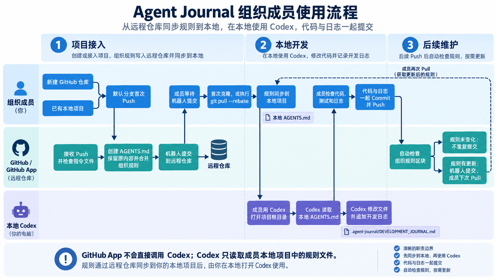

# Agent Journal 成员使用说明

组织成员可以直接在 GitHub 中创建新仓库，也可以将已有本地项目推送到组织的空仓库；默认分支首次收到代码后，GitHub App 会自动检查项目中的 Agent 指令文件，不存在时创建 AGENTS.md，已经存在时保留成员原有内容并合并组织规则，再通过机器人提交到远程仓库（首次提交的边界：在创建想的时候如果勾选了README.md或其他文件也是首次push了内容，这个时候就会首次创建AGENTS文件。如果在创建github项目的时候没有勾选任何东西，则首次从本地push项目时才会算是首次提交）。
成员等待提交完成后，需要克隆项目或执行 git pull --rebase，将规则同步到本地，然后使用 Codex 打开项目根目录。Codex 读取本地 AGENTS.md 后完成开发任务，并将修改过程追加到 .agent-journal/DEVELOPMENT_JOURNAL.md。成员检查代码、测试结果和开发日志后，将代码与日志一起提交并推送；后续每次推送都会自动检查组织规则，规则没有变化时不会重复提交，有更新时成员再次拉取即可。
## 项目说明

本组织使用 Agent Journal 记录由代码智能体参与的项目开发过程。

组织仓库的默认分支首次收到代码后，GitHub App 会自动创建或更新项目根目录中的 Agent 指令文件。

使用桌面端 Codex 修改项目时，Codex 会根据该指令文件，将本次任务的目标、修改过程、修改内容、遇到的问题和验证结果记录到：

```text
.agent-journal/DEVELOPMENT_JOURNAL.md
```

开发日志需要与本次代码修改一起提交到 GitHub。

## 当前已经完成的功能

目前已经完成并实际验证以下功能：

* 监听组织仓库的默认分支 Push 事件。
* 默认分支首次推送后自动安装 Agent Journal 规则。
* 自动创建或更新项目根目录中的 `AGENTS.md`。
* 仓库已有 `AGENTS.md` 时保留成员原有内容。
* 使用受管理区块追加和更新组织开发日志规则。
* 避免重复加入相同的组织规则。
* 桌面端 Codex 可以自动读取项目规则。
* Codex 修改项目文件后，可以创建或追加开发日志。
* 开发日志可以记录任务目标、修改过程、修改内容、问题和验证结果。
* 已有开发日志不会在后续任务中被主动删除或覆盖。
* Agent Journal 自己产生的提交不会形成重复提交循环。

## 成员需要做什么

成员只需要完成以下工作：

1. 在组织中创建仓库或将已有项目推送到组织仓库。
2. 等待 GitHub App 完成 Agent Journal 初始化。
3. 开始任务前拉取远程最新内容。
4. 使用桌面端 Codex 打开项目根目录。
5. 让 Codex 正常完成开发任务。
6. 检查代码、测试结果和开发日志。
7. 将代码与开发日志一起提交并推送。

## 创建新项目

### 在 GitHub 中直接创建项目

在 GitHub 组织中创建仓库时，可以根据项目需要选择是否初始化 `README.md`。

如果创建仓库时勾选了：

```text
Add a README file
```

GitHub 会产生第一次默认分支推送，GitHub App 随后会自动创建或更新 Agent 指令文件。

等待仓库中出现以下文件：

```text
AGENTS.md
```

机器人提交的名称通常为：

```text
chore: add agent journal instructions
```

看到该提交后，再克隆仓库并开始开发。

如果仓库中暂时没有任何文件，GitHub App 会等待默认分支第一次收到代码，不会提前向空仓库创建提交。

### 将已有本地项目推送到组织

如果项目已经在本地开发完成，可以在 GitHub 组织中创建一个完全空的仓库。

创建远程仓库时不要初始化以下内容：

* `README.md`
* `.gitignore`
* License

在本地项目中设置远程地址：

```powershell
git remote add origin <仓库地址>
git branch -M main
git push --set-upstream origin main
```

如果本地已经存在 `origin`，使用：

```powershell
git remote set-url origin <仓库地址>
git push --set-upstream origin main
```

第一次推送可以正常完成。GitHub App 不会在成员第一次推送之前抢先向空仓库提交文件。

首次推送完成后，GitHub App 会通过一个新的机器人提交创建或更新 Agent 指令文件。

等待机器人提交完成，然后执行：

```powershell
git pull --rebase
```

完成同步后再继续开发。

不要在首次推送后立即修改 `AGENTS.md`。如果本地修改和机器人的远程修改发生在同一位置，执行 `git pull --rebase` 时可能产生合并冲突。

## 已有 Agent 指令文件的处理方式

如果项目原来不存在 `AGENTS.md`，GitHub App 会自动创建该文件。

如果项目已经存在 `AGENTS.md`，GitHub App 不会删除或覆盖成员编写的内容，只会在文件中追加组织管理区块。

组织管理区块使用以下标记：

```text
<!-- AGENT-JOURNAL:START -->
<!-- AGENT-JOURNAL:END -->
```

成员可以继续维护自己编写的 Agent 规则，但不要删除、移动或手动修改这两个标记之间的组织管理内容。

如果根目录中存在 `AGENTS.override.md`，GitHub App 会优先将组织管理区块写入该文件。

当组织管理区块已经是最新版本时，GitHub App 不会再次修改文件，也不会产生重复提交。

## 获取项目

第一次参与项目时执行：

```powershell
git clone <仓库地址>
cd <项目目录>
```

进入项目目录后确认存在以下文件之一：

```text
AGENTS.md
AGENTS.override.md
```

如果本地已经有该仓库，每次开始新任务前执行：

```powershell
git pull --rebase
```

如果本地存在尚未提交的修改，需要先提交或暂存这些修改，再执行拉取。

## 使用桌面端 Codex

在桌面端 Codex 中打开项目根目录。

必须选择包含 `.git` 和 Agent 指令文件的仓库目录，不要只打开某个子目录，也不要选择多个项目共同所在的上级目录。

第一次打开项目后，可以先向 Codex 发送：

```text
不要修改任何文件。请告诉我当前项目加载了哪些项目级指令文件，并概括核心要求。
```

正常情况下，Codex 应当识别项目根目录中的 `AGENTS.md` 或 `AGENTS.override.md`，并说明开发日志要求。

确认成功后，按照正常方式描述开发任务即可，不需要在每次任务中重复要求 Codex 编写开发日志。

## 完成任务后

Codex 完成代码修改后，成员需要检查：

* 代码是否符合任务要求。
* 测试或检查命令是否执行成功。
* 是否创建或更新了开发日志。
* 日志是否只在文件末尾追加。
* 日志是否包含本次实际修改内容。
* 日志中是否存在密码、Token、私钥等敏感信息。
* 是否存在不应提交的临时文件。

检查 Git 状态：

```powershell
git status --short
```

查看开发日志：

```powershell
Get-Content .agent-journal\DEVELOPMENT_JOURNAL.md
```

确认无误后提交：

```powershell
git add .
git commit -m "描述本次修改"
git push
```

如果推送时提示远程仓库包含新提交，先执行：

```powershell
git pull --rebase
```

解决同步问题后再执行：

```powershell
git push
```

## 开发日志规则

开发日志路径为：

```text
.agent-journal/DEVELOPMENT_JOURNAL.md
```

当 Codex 实际修改代码、文档、配置或其他项目文件时，应当在任务结束前追加一条日志。

每条日志主要包括：

* 任务目标
* 修改过程
* 修改内容
* 遇到的问题与处理
* 验证结果
* 遗留事项

日志只允许在文件末尾追加。

不得删除、覆盖、重写或压缩以前的历史记录。

如果以前的日志存在错误，应当追加更正说明，不应直接修改历史记录。

只查看项目、分析问题或回答问题，没有产生文件修改时，不需要写开发日志。

更新开发日志本身不需要再产生一条额外日志。

日志中不得写入：

* 密码
* Token
* 私钥
* Webhook Secret
* 账号凭据
* 其他敏感信息
* 代码智能体的隐藏推理过程

“修改过程”只记录能够复现的技术步骤。

## 当前工作流程

完整工作流程如下：

```text
成员创建组织仓库
        ↓
成员向默认分支第一次推送内容
        ↓
GitHub App 接收 Push 事件
        ↓
检查 AGENTS.md 或 AGENTS.override.md
        ↓
创建或更新 Agent Journal 组织管理区块
        ↓
成员执行 git pull --rebase
        ↓
成员使用桌面端 Codex 开发
        ↓
Codex 修改项目并追加开发日志
        ↓
成员检查代码和日志
        ↓
成员提交并推送代码与日志
```

后续每次默认分支收到推送时，GitHub App 都会检查组织管理区块。

如果管理区块已经是最新版本，检查结束后不会产生新的提交。

## 当前限制

### 服务必须保持在线

当前 GitHub App 服务需要保持运行，并且 Webhook 地址必须能够被 GitHub 访问。

如果服务停止、网络中断或临时公网地址失效，GitHub 事件可能无法及时处理。

成员发现仓库没有自动加入 Agent Journal 规则时，应联系项目管理员检查服务状态。

### 首次推送后需要等待机器人提交

GitHub App 会在默认分支第一次推送完成后，通过一个独立的机器人提交创建或更新 Agent 指令文件。

成员首次推送后需要等待机器人提交，并执行：

```powershell
git pull --rebase
```

如果机器人提交尚未同步到本地就继续修改相同文件，可能产生合并冲突。

### 开发日志依赖代码智能体执行

当前开发日志主要由桌面端 Codex 根据项目指令生成。

如果成员完全手动修改代码，或者使用不支持项目指令文件的开发工具，开发日志不会自动生成。

这种情况下，成员需要自行按照规定补充开发日志。

### 当前只验证了桌面端 Codex

目前已经完成桌面端 Codex 的实际测试。

其他代码智能体是否能够自动识别并遵守 `AGENTS.md`，需要根据具体工具分别测试。

### 日志内容仍需人工检查

Codex 生成的开发日志可能存在遗漏或描述不准确的情况。

成员提交前仍需检查本次新增记录，可以修正本次新增内容，但不能删除或重写以前的历史记录。

### 当前不会自动阻止不合规提交

当前版本可以向代码智能体提供日志规则，但还没有通过 CI 检查强制阻止缺少开发日志的提交。

成员仍需在提交前主动检查日志是否已经更新。

## 常见问题

### 仓库中没有 AGENTS.md

确认仓库的默认分支是否已经产生至少一次有效推送。

如果远程仓库已经存在 Agent 指令文件，本地执行：

```powershell
git pull --rebase
```

如果远程仓库也不存在该文件，请联系项目管理员检查 GitHub App 和 Webhook 服务。

### Codex 没有识别项目规则

确认桌面端 Codex 打开的是项目根目录。

项目根目录中应存在：

```text
AGENTS.md
```

或者：

```text
AGENTS.override.md
```

重新打开正确的项目目录，并新建一个 Codex 对话，再让 Codex说明当前加载的项目级指令文件。

### 推送时提示远程仓库有新提交

GitHub App 或其他成员可能已经提交了新内容。

执行：

```powershell
git pull --rebase
```

如果本地存在未提交修改，先提交或暂存修改。

完成同步后再执行：

```powershell
git push
```

### git pull --rebase 提示存在未提交修改

先查看本地文件状态：

```powershell
git status --short
```

如果这些修改需要保留，可以提交：

```powershell
git add .
git commit -m "描述本次修改"
git pull --rebase
```

也可以先暂存：

```powershell
git stash
git pull --rebase
git stash pop
```

### AGENTS.md 出现合并冲突

不要直接删除整个文件，也不要使用“全部接受双方修改”盲目合并。

需要同时保留：

* 成员自己编写的项目规则。
* `AGENT-JOURNAL:START` 与 `AGENT-JOURNAL:END` 之间的组织管理区块。

无法确认如何合并时，请停止 rebase 并联系项目管理员处理。

### 开发日志没有生成

检查本次任务是否实际修改了项目文件。

如果产生了修改但没有更新日志，可以明确告诉 Codex：

```text
请按照项目级指令检查本次文件修改，并在 .agent-journal/DEVELOPMENT_JOURNAL.md 末尾追加本次开发记录。不要修改或删除以前的日志。
```

### 开发日志能否删除

不能。

开发日志用于持续保留项目修改过程，只允许在末尾追加。错误内容应通过追加更正记录处理。
